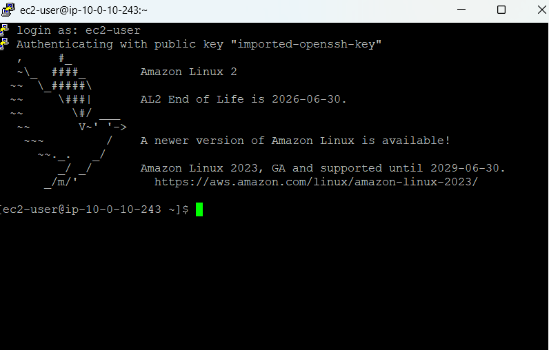
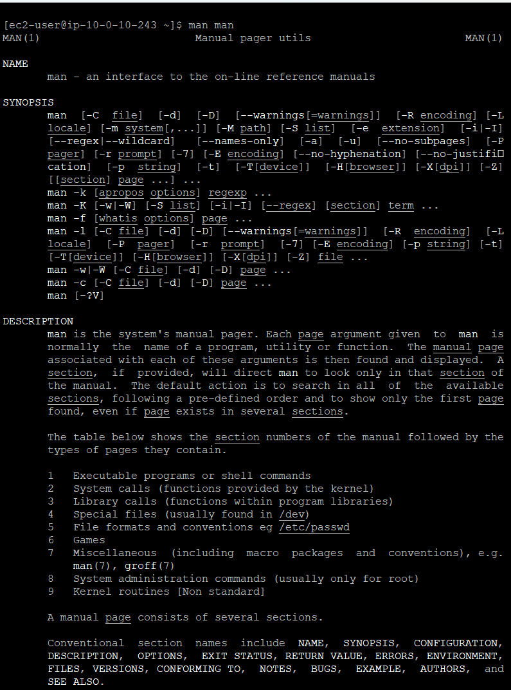

# 🐧 Linux Learning Labs

Hands-on system administration, terminal command notes, and lab practice at **Per Scholas**.

---

## 📍 Lab 01: Remote Access (SSH) & Linux Documentation

**Environment:** Amazon Linux 2 (AWS EC2 Instance)

### 1. Hands-On Execution
- Connected to an Amazon Linux AMI instance using **SSH**.
- Executed `man man` to explore system documentation and manual page structures.

### 2. Key Commands & Shortcuts Learned
* `man <command>` — Opens the system manual for a specific command.
* `/keyword` — Searches for specific text forward within a manual page.
* `q` — Exits the manual page viewer back to the shell prompt.

### 3. Lab Proof

  <b>SSH Terminal Access:</b> 
  

  <b>Manual Page Exploration (man man):</b> 
  

